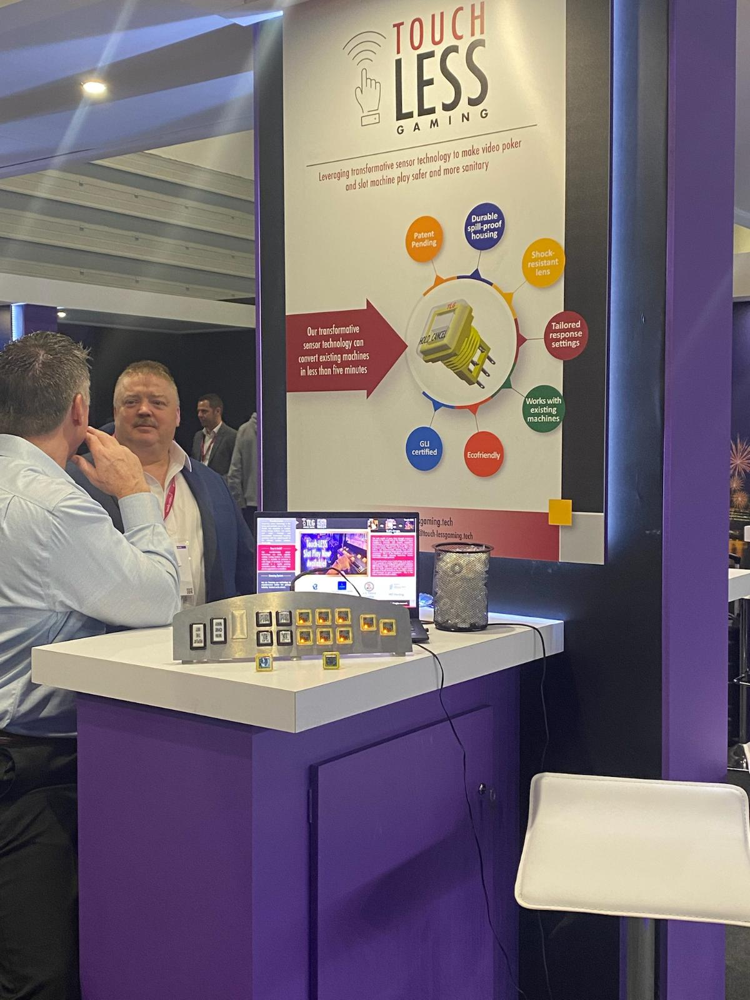
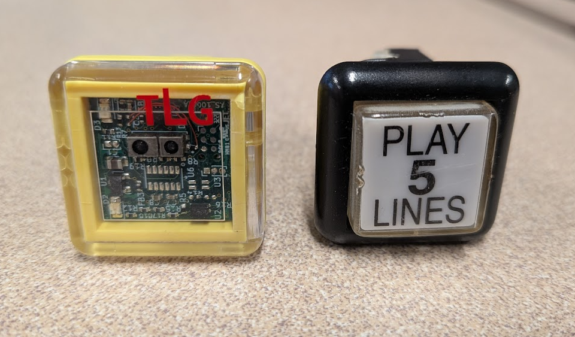

# Touchless Proximity Button for Gaming Machines

**🏆 Winner - Pitch@ICE, ExCeL London 2022**

*Presenting at Pitch@ICE, ExCeL London 2022*

---

## Product Photos

### Casino Installation - Live Deployment

*Touchless button in active use at casino in Mexico*

### Drop-In Replacement Design

*Front view comparison - seamless retrofit*

*Back view showing drop-in compatibility with existing gaming hardware*

---

## Overview

Contactless button system designed for retrofit installation in slot machines and gaming equipment. 
Developed during the COVID-19 pandemic to eliminate surface contamination while maintaining gaming commission compliance and player experience.

**Deployed commercially in casinos across Cancun and Monterrey, Mexico.**

---

## The Problem

During COVID-19, casino slot machines posed significant contamination risks:
- Thousands of button presses per machine per day
- High-touch surfaces in high-traffic environments
- Existing touchless solutions were prohibitively expensive or required complete machine replacement
- Gaming regulations required specific response times and reliability standards
- Retrofitting existing equipment was essential for casino operators

---

## The Solution

Developed a drop-in touchless proximity sensing system that:
- Detects hand presence without physical contact
- Retrofits existing slot machines without modification
- Maintains gaming commission compliance
- Preserves familiar player experience
- Cost-effective compared to machine replacement

---

## Technical Innovation

**Covered by US Patent 12,417,670 B2**

The system uses advanced proximity sensing technology to detect player intent without requiring physical button contact. Key innovations include:

- Capacitive proximity detection optimized for gaming environments
- Fast response time meeting gambling regulation requirements  
- Robust operation in challenging casino floor conditions
- Simple retrofit installation compatible with existing gaming hardware
- Low power consumption for continuous operation

*Detailed technical specifications available in published patent documentation.*

---

## Recognition & Impact

### Awards
🏆 **Winner - Pitch@ICE 2022**
- ExCeL London, UK
- Gaming industry innovation competition
- Selected from international entries

### Commercial Deployment
- Installed in casinos in Cancun, Mexico
- Installed in casinos in Monterrey, Mexico
- Proven reliability in high-volume gaming environments
- 100% elimination of button surface contact

---

## Patent Information

Patent Number: US 12,417,670 B2  
Title: TOUCHLESS COMPUTER INTERFACES  
Lead Inventor: Matthew Craig Spencer
Status: Granted

[View full patent on USPTO](https://patents.google.com/patent/US12417670B2)

---

## Technical Details

*Full technical specifications, performance data, and implementation details available upon request for licensing or partnership inquiries.*

**Key capabilities:**
- Proximity-based activation
- Gaming regulation compliant response time
- Environmental durability (casino floor rated)
- Retrofit-compatible design
- Commercial-grade reliability
  
---

## Hardware Design Files

### PCB Design
3D renderings of the PCB:

*PCB Top View - 3D Render*

*PCB Bottom View - 3D Render*

### Design Documentation
- **Schematic:** [View PDF](hardware/pcb/Schematic_Final.pdf)
- **Bill of Materials:** [View PDF](hardware/pcb/Assembly Bill of Materials.pdf)
- **Gerber Files:** Available in `/hardware/pcb/gerbers/` for manufacturing

## Media & Press

- Pitch@ICE ExCeL London 2022 - Innovation Award Winner

## Applications

- Slot machines and gaming terminals
- Casino floor equipment
- High-traffic public gaming environments
- Retrofit installations requiring minimal downtime

---

## Contact

For licensing inquiries, partnership opportunities, or technical specifications, please contact via GitHub.

---

*Note: This repository showcases the innovation and commercial success of this patented technology. 
Proprietary manufacturing details and complete implementation specifications are available under appropriate agreements.*
